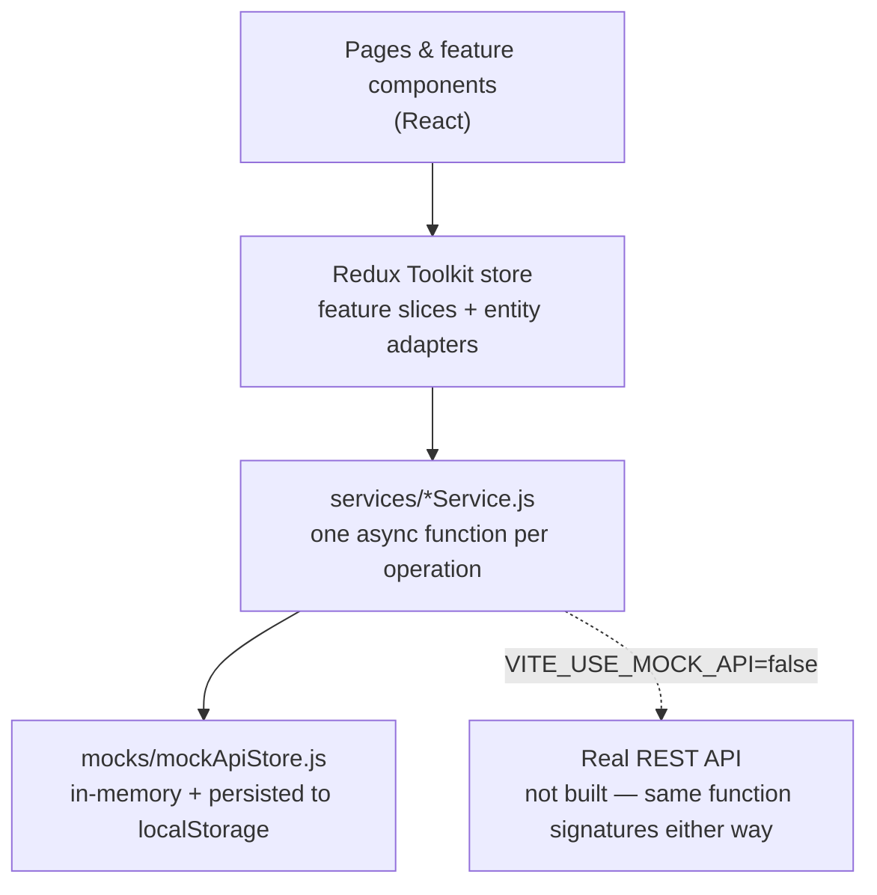
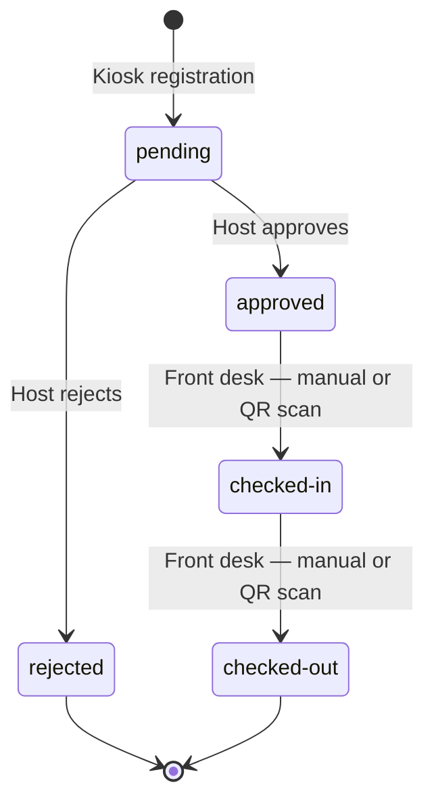
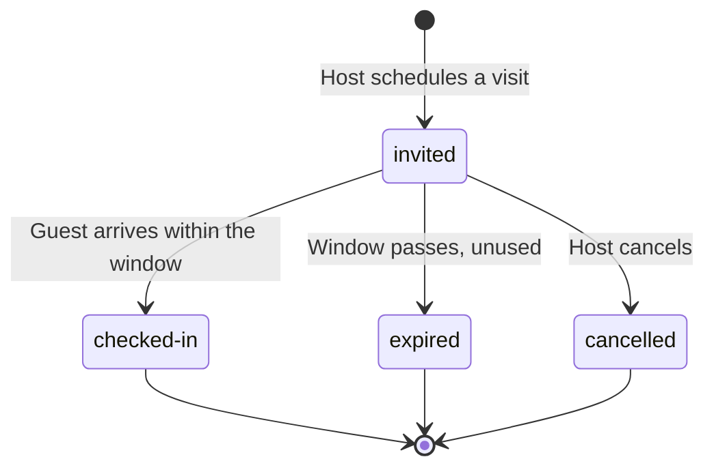

# GuestFlow — Visitor Management System

A workplace Visitor Management System: a visitor registers at a kiosk, their host employee approves or rejects the request, hosts can pre-approve guests in advance with a QR e-pass, and front desk runs a live dashboard to check people in and out — including scanning a visitor's badge directly.

Built as a case-study submission for the MoveInSync Frontend Intern role. All four flows described in the case study are complete and working end to end, backed entirely by mock data (no live backend — see [Architecture](#architecture) for why, and how that boundary is drawn).

## The problem

A front desk needs to know, at any moment, exactly who is in the building, who they're visiting, and whether they were actually authorized to be there — without turning every visit into a five-minute manual process at the gate. That means three things have to work together: a fast way to register a walk-in, a way for the person being visited to approve them without a phone call, and a way to skip all of that entirely for guests who were expected.

## Who uses it, and how

There's no real login in this demo — a role switcher stands in for auth, since the assignment scope is the four flows, not an auth system. In a real deployment each of these would be an actual account:

| Role | Who they are | What they do in the app |
|---|---|---|
| **Visitor** | Someone arriving from outside the company | Fills out the kiosk form — name, phone, purpose, host, mandatory live photo — then waits |
| **Host** | A company employee being visited | Approves/rejects walk-in requests in their inbox; can also pre-schedule a visit in advance so their guest skips the approval wait entirely |
| **Front Desk / Security** | Reception or the security guard | Runs the kiosk on a visitor's behalf if needed; watches the live dashboard of everyone in the building; checks people in/out, including by scanning a visitor's QR badge; handles overstays |
| **Admin** | Whoever manages the system (HR/facilities/IT) | Sets the rules everyone else operates under — daily pre-approval limits, the overstay threshold, office locations, and which employees count as hosts |

## The four flows

### 1. Visitor Registration (Kiosk) — `/app/kiosk`
A walk-in visitor (or the guard, on their behalf) fills out name, phone, email, purpose, host, company, and visit type, plus a **mandatory live photo** captured from the device camera — not an upload, on purpose (see [Design decisions](#a-few-decisions-worth-defending) below). Submitting creates a `pending` visitor record and shows a confirmation screen; nothing else happens until the host acts.

### 2. Host Approval — `/app/inbox`
A host sees only the requests naming them, scoped by an "acting as" picker. **Approve** moves the visitor to `approved` and generates a QR visitor badge; **Reject** ends the flow there. Every action is logged to an audit trail visible in the same screen.

### 3. Pre-Approved Invites — `/app/invites`
The opposite direction: a host schedules a visit **in advance** — date/time window, guests, a note — and the system issues a QR e-pass immediately, no approval wait, capped at a configurable number of invites per host per day. An invite auto-expires if the guest never arrives within the window.

### 4. Front Desk Dashboard — `/app/front-desk`
The live operational view: every visitor, searchable and filterable, paginated. Clicking a row opens full guest details — host pairing, check-in/out timeline, audit history, and (once approved) the visitor's QR badge. Front desk can **Check-In**/**Check-Out** manually from that panel, or scan a visitor's badge directly with the device camera — the scanner looks the visitor up and offers exactly the one valid action for their current status. An "overstay" flag appears automatically once someone's been checked in past a configurable threshold.

### Admin — `/app/admin`
Configures the rules the other three flows enforce (pre-approval limit, overstay threshold, office list) and manages the host/employee directory — add or remove who counts as a host.

## Architecture



**The one boundary that matters:** components and reducers never import mock data directly — they only ever call a `services/*Service.js` function, which returns a promise either way. Today those functions read/write an in-memory store (persisted to `localStorage` so a page refresh doesn't lose demo state); pointed at a real backend, the exact same function signatures would call `fetch` instead. Nothing above that layer would need to change. The mock layer also deliberately simulates real-world imperfection — 200–700ms latency and an ~8% random write-failure rate — specifically so the error-handling UI (toasts, disabled-while-mutating buttons, rollback) gets exercised during development instead of only existing in theory.

### Visitor status lifecycle

Every status change goes through one transition table (`lib/statusTransitions.js`) — an invalid move (checking out someone who never checked in, approving a rejected visitor) is rejected there, in one place, not by UI discipline at each call site.



### Invite lifecycle



## Tech stack

| Layer | Choice | Why |
|---|---|---|
| Framework | React 19 + Vite | Case study allows any framework; optimized for the quality achievable in the time available — the architecture (feature modules, a service boundary, an explicit state machine) maps directly onto Angular, the stack this role actually uses |
| Language | Plain JavaScript, no TypeScript | Honest tradeoff for delivery speed — mitigated with consistent data shapes and validation at every boundary (see `docs/03-design-system.md`, `docs/05-state-management-redux.md`) |
| State | Redux Toolkit — `createSlice`, `createAsyncThunk`, `createEntityAdapter`, `createSelector` | Normalized state (O(1) lookup by id), memoized derived data, and DevTools-visible action history for debugging a status transition |
| Styling | Tailwind CSS v4 + shadcn/ui | Solid colors only, no gradients, a dense enterprise-tool type scale — see `docs/03-design-system.md` |
| Data fetching | Axios, behind one `services/apiClient.js` | Never called directly by mock-mode code; only exists so the real-API path is a one-file change |
| QR | `react-qr-code` (generate) + `jsqr` (decode) | Pure client-side, no native dependency, matches the mock-only architecture |
| Routing | React Router v7 (data router) | `routes.jsx` (definitions) is split from `router.jsx` (the real singleton) specifically so the definitions can be reused in `createMemoryRouter` for isolated local verification without fighting a browser-history singleton |

## Folder layout

```
GuestFlow/
├── public/              full-logo.png / logo-icon.png / hero.png / login-ref.png — provided artwork
├── src/
│   ├── core/             App shell, route definitions/router, Redux Provider, cross-cutting ui slice
│   ├── pages/             one file per route
│   ├── features/          registration/ · approval/ · invites/ · front-desk/ · admin/ — each owns its components + slice
│   ├── components/        ui/ (shadcn primitives) · layout/ (AppShell, Sidebar, Topbar) · marketing/ (landing page) · shared (FlowBanner, StatusBadge, DatePicker, ...)
│   ├── services/          one async function per operation — the only mock-aware layer
│   ├── mocks/              in-memory + localStorage-backed "database" and its seed generators
│   ├── lib/                 pure utilities — status transitions, date formatting, validators
│   ├── hooks/               useDebounce, useTheme
│   └── constants/            routes, roles, visit types
├── docs/                  full requirements/architecture/design-system/decision docs — start with docs/00-prd.md
└── demo/                  screenshots / demo video (linked below once recorded)
```

Full folder/naming conventions: [`docs/04-folder-and-naming-conventions.md`](docs/04-folder-and-naming-conventions.md).

## Running it locally

```bash
npm install
npm run dev       # http://localhost:5173
npm run build     # production build
npm run lint
```

No environment variables are required to run in mock mode (the default). `VITE_USE_MOCK_API=false` plus `VITE_API_BASE_URL` would point the same service functions at a real backend, if one existed.

## A few decisions worth defending

The full dated reasoning lives in [`docs/design-decisions.md`](docs/design-decisions.md) and the root [`DECISIONS.md`](../DECISIONS.md); the short version of the ones most likely to come up:

- **The kiosk photo is camera-only, upload is a fallback, not a shortcut.** A mandatory photo exists to verify who actually showed up — offering "upload a file" as an equally-easy option next to a working camera would defeat that. Upload only appears once the camera has genuinely failed (denied permission or no hardware), so registration never dead-ends on a device without one.
- **Pagination over virtualization for the front-desk table.** At the dataset sizes this app targets, slicing the filtered array to one page keeps render cost at O(page size) regardless of total rows — simpler, no extra dependency. Virtualization is the documented next step if the dataset were two or three orders of magnitude larger.
- **Derived, not stored.** Overstay status, invite expiry, and every filtered/sorted list are computed on read from the underlying entities, never written as a separate flag — a value that has to be kept in sync in two places is a bug waiting to happen. See `docs/design-decisions.md` for the full list and the one deliberate exception (the per-host daily invite counter, cached for a genuine complexity reason, documented there).
- **QR check-in scanning is scoped to walk-in visitor badges, not the pre-approval e-pass.** The two QR codes encode different things (a visitor id vs. an invite code), and what "checking in a pre-approved invite" should actually create in the data model is a real open question, not something to guess at silently.

## Full documentation

Start with [`docs/00-prd.md`](docs/00-prd.md) and [`docs/RULES.md`](docs/RULES.md) (the enforcement checklist every screen was built against). The rest of `docs/` covers architecture & data (`01`), tech stack (`02`), design system (`03`), folder/naming conventions (`04`), state management (`05`), the shadcn component layer (`06`), image assets (`07`), and the full dated design-decision log (`design-decisions.md`).
